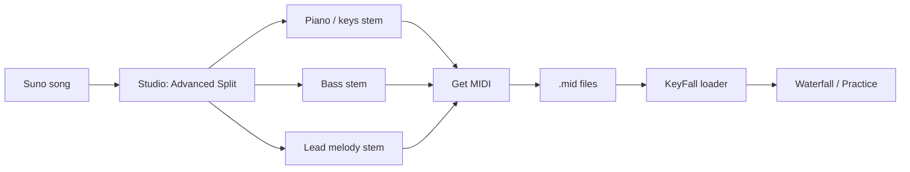

# Competitive Landscape

Analysis of piano learning apps and open-source alternatives, focused on how KeyFall can differentiate.

---

## Commercial Competitors

### Synthesia

| | |
|---|---|
| **Audio approach** | MIDI playback only — no synthesis engine, relies on device sound or connected keyboard |
| **Key features** | Falling-note display, wait mode, optional notation overlay, hand separation, finger number hints, lighted keyboard support, MusicXML import, 150 included songs + any MIDI file |
| **Pricing** | Free (limited) + one-time $39 Learning Pack |
| **Platforms** | Windows, macOS, iOS, Android |
| **Limitations** | No music theory instruction; no chord/scale teaching; encourages bypassing sheet music reading; no microphone support for acoustic pianos; purely a note-matching tool with no pedagogical depth |

### Simply Piano (JoyTunes)

| | |
|---|---|
| **Audio approach** | Real-time note recognition via device microphone or MIDI connection |
| **Key features** | 1,200+ songs, structured beginner-to-advanced curriculum, technique drills, theory modules, live instructor-led group sessions, cross-device progress sync |
| **Pricing** | ~$20/month, ~$100/year. 7-day trial |
| **Platforms** | iOS, Android, Web (limited — no mic on web) |
| **Limitations** | Web version lacks real-time feedback; no rewind in songs; aggressive note highlighting with no disable option; confusing family/individual plan gating |

### Flowkey

| | |
|---|---|
| **Audio approach** | Microphone pitch recognition for acoustic pianos, USB/MIDI for digital pianos |
| **Key features** | 1,500+ songs with multiple difficulty levels, split-screen notation + pianist video, wait/slow/fast modes, structured courses, hand separation |
| **Pricing** | Free tier (8 songs). Premium ~$20/month or ~$10/month billed annually. Family plan available |
| **Platforms** | iOS, Android, Web |
| **Limitations** | Note recognition unreliable (false stops mid-piece); limited advanced theory; no formal assessment or exam prep |

### Playground Sessions

| | |
|---|---|
| **Audio approach** | MIDI-based real-time feedback with green/red/pink note scoring. Mic recognition in beta |
| **Key features** | 100+ hours of video lessons, 2,000+ songs, Rookie/Intermediate/Advanced curriculum, gamification with medals/trophies, co-created with Quincy Jones |
| **Pricing** | Monthly $25, Annual $150, Lifetime $349. 7-day trial |
| **Platforms** | Windows, macOS, iOS, Android |
| **Limitations** | No custom music import; slow song additions; no progress reset; advanced jazz/classical theory lacking; mic feedback still beta-quality |

### Skoove

| | |
|---|---|
| **Audio approach** | AI note recognition via microphone, Bluetooth, or MIDI |
| **Key features** | "Listen, learn, play" method; 500+ interactive video lessons across 19 courses; AI real-time feedback; one-on-one lessons with real teachers (Skoove Duo); 7 languages |
| **Pricing** | Free tier. Premium ~$13/month (quarterly) or ~$10/month (annual) |
| **Platforms** | iOS, Android, Web |
| **Limitations** | Smaller content library (500 vs 1,200+); less advanced material; mic recognition quality varies |

### Piano Marvel

| | |
|---|---|
| **Audio approach** | USB/MIDI keyboard for real-time assessment. "Book mode" for acoustic pianos (no assessment) |
| **Key features** | 28,000+ songs and 1,200 lessons across 18 levels; SASR adaptive sight-reading tests; ABRSM exam prep; teacher tools; scales, arpeggios, ear training, flashcards |
| **Pricing** | Free tier (200+ songs). Premium ~$16-18/month or ~$110-120/year. 7-day trial |
| **Platforms** | Web (Mac/PC), iOS (iPad only). No Android |
| **Limitations** | No Android; acoustic piano mode lacks feedback; web-only on desktop; utilitarian UI; primarily MIDI-dependent |

### Yousician Piano

| | |
|---|---|
| **Audio approach** | Microphone real-time audio recognition + MIDI connection |
| **Key features** | 1,500+ missions, Classical/Knowledge/Pop paths, multiple notation options, adjustable tempo, hand separation, multi-instrument platform |
| **Pricing** | Free tier (limited daily practice). Premium ~$20/month or ~$120/year |
| **Platforms** | Windows, macOS, iOS, Android |
| **Limitations** | Shallow feedback — lacks detailed performance analysis; mediocre song arrangements; insufficient advanced material; multi-instrument jack-of-all-trades means piano depth suffers |

---

## Open-Source Alternatives

| Project | Description | Status |
|---------|-------------|--------|
| [Neothesia](https://github.com/PolyMeilex/Neothesia) | Modern Rust-based falling-note MIDI player with polished visuals | Actively maintained — strongest OSS competitor |
| [Linthesia](https://github.com/allan-simon/linthesia) | Fork of pre-0.6.1 open-source Synthesia. Falling-note MIDI player | Largely unmaintained |
| PianoBooster | Scrolling music stave with MIDI keyboard input. Most popular Linux option | Maintained |
| [Sightread](https://sightread.dev) | Browser-based falling-notes + "Sheet Hero" trainer (TypeScript, GPL-3.0). See detailed entry below | Public repo frozen March 2026; development continues privately |
| Midiano | Web app that plays any MIDI file with interactive piano display | Active |

### Sightread (sightread.dev)

| | |
|---|---|
| **Audio approach** | In-browser SoundFont synth with selectable instruments; can also send notes out to a MIDI keyboard |
| **Key features** | Falling notes and "Sheet Hero" (beta, falling notes on a staff) with note labels; Web MIDI input and output plus computer-keyboard fallback; wait mode; per-hand show/play settings; speed control; section looping; metronome; key-signature display; free play; small training games (speed, phrases); ~80 bundled public-domain songs; upload your own MIDI files (kept in browser storage) |
| **Pricing** | Free |
| **Platforms** | Web — Chrome and Firefox. No iOS (Web MIDI unavailable in WebKit); iOS app on roadmap |
| **License** | GPL-3.0. As of March 4, 2026 the public repo is a frozen snapshot (PRs disabled); new work happens in a private repo, with a stated plan to re-open "as much as possible" in 2027 |
| **Limitations** | Its own roadmap lists MusicXML upload, full sheet music, progress tracking/scoring, difficulty scaling, and recording/sharing as not yet shipped; no microphone input; no pedagogy or technique feedback; browser-only, so audio latency depends on Web Audio; GPL limits embedding in proprietary products |

**Takeaway for KeyFall:** Sightread is the closest open-source analogue and is ahead on polish (MIDI output, device picker, bundled library, zero-install web delivery). KeyFall's openings are the things on Sightread's roadmap that KeyFall already has — MusicXML, scoring and progress history, difficulty estimation — plus a permissive license and an open, accepting development model now that Sightread has gone private.

---

## Summary Comparison

| App | Audio Approach | Pricing | Theory Depth | Acoustic Support |
|-----|---------------|---------|-------------|-----------------|
| Synthesia | MIDI playback only | One-time $39 | None | No |
| Simply Piano | Mic + MIDI | ~$100/yr | Moderate | Yes (mic) |
| Flowkey | Mic + MIDI | ~$120/yr | Basic | Yes (mic) |
| Playground Sessions | MIDI + mic (beta) | ~$150/yr or $349 lifetime | Moderate | Beta |
| Skoove | AI mic + MIDI | ~$120/yr | Basic-Moderate | Yes (mic) |
| Piano Marvel | MIDI only | ~$120/yr | Deep (exam prep) | Partial |
| Yousician | Mic + MIDI | ~$120/yr | Basic | Yes (mic) |
| Sightread | Web MIDI in/out + browser synth | Free (GPL-3.0, now privately developed) | None | No |

---

## KeyFall Differentiation Opportunities

**No competitor does real piano synthesis well.** Every app either plays back raw MIDI samples or relies entirely on the user's own instrument for sound. This is KeyFall's primary opening — but synthesis is only one of several structural advantages.

### Core differentiators

1. **Pure Python** — The entire engine is Python 3.11+. Every competitor is either closed-source or written in a systems language (Neothesia is Rust, PianoBooster is C++). Python lowers the contribution barrier dramatically — music teachers, students, and hobbyist developers can read, modify, and extend KeyFall without learning a compiled language. The Python ecosystem (numpy, scipy, music21, mido, pygame) gives access to world-class scientific computing and music analysis libraries with minimal glue code.

2. **Plugin system** — No competitor offers any extensibility. KeyFall's planned plugin architecture (scoring, visualization, input, and view plugins via Python entry points) means the community can build custom game modes, grading systems, notation styles, and input methods without forking the project. This turns KeyFall from a single app into a platform.

3. **Open source (Apache 2.0)** — Synthesia is closed-source. Simply Piano, Flowkey, Skoove, Playground Sessions, and Yousician are proprietary SaaS. The only active OSS competitor is Neothesia, which has no audio synthesis, pedagogy, or evaluation system. KeyFall is the only open-source project combining a falling-note engine, hit evaluation, progress tracking, and audio synthesis — and its permissive license means it can be embedded in commercial products, forked by schools, or adopted by researchers.

4. **Free, no subscription** — Subscription fatigue is real. Competitors charge $100-150/year. Synthesia proved one-time pricing works at $39. KeyFall being completely free removes the last barrier for students worldwide, especially in regions where $100/year is prohibitive.

### Technical differentiators

5. **Synthesis quality** — All competitors use basic SoundFont/sample playback with no physical modeling. KeyFall's planned improvements (sympathetic resonance, half-pedaling, release samples, velocity-curve timbral morphing, soundboard convolution, adaptive latency) are features found only in professional virtual instruments costing $100-400, not in any learning app.

6. **Expressive technique** — No app supports half-pedaling, key-off velocity, or continuous dynamics. Advanced students have no tool that rewards expressive playing. KeyFall can be the first learning tool that teaches musicality, not just note accuracy.

7. **Latency** — Competitors accept default audio backend latency (40-50ms). KeyFall's adaptive latency engine with predictive voice pre-allocation targets <10ms on capable hardware.

8. **Modular architecture** — Each subsystem (song loading, rendering, evaluation, audio, input, progress) is a standalone module with clean interfaces. This makes it viable as a library — embed just the evaluator in a teaching app, or just the renderer in a music visualizer. No competitor is designed for reuse.

### Ecosystem differentiators

9. **Cross-platform from day one** — Python + pygame runs on Linux, macOS, and Windows without platform-specific builds. Competitors either skip Linux entirely (Piano Marvel, Playground Sessions) or treat it as an afterthought.

10. **Hackable for education and research** — Music education researchers can instrument KeyFall to collect practice data, test pedagogical hypotheses, or prototype new teaching methods. No commercial app exposes this level of access. A university could fork KeyFall for a piano lab; a PhD student could add an adaptive difficulty plugin; a teacher could write a custom scoring plugin that rewards sight-reading over memorization.

11. **MIDI and MusicXML import** — Synthesia supports MIDI import. Most subscription apps lock users into their curated song libraries. KeyFall supports both MIDI and MusicXML, meaning any score from MuseScore, IMSLP, or a student's own compositions can be loaded immediately.

12. **Community-driven content** — With a plugin system and open file format support, the community can share song packs, custom game modes, and scoring algorithms. No competitor has this — their content is gated behind subscriptions and editorial curation.

### AI differentiators

13. **Adaptive difficulty engine** — Track per-pitch and per-interval error rates in real time and automatically adjust tempo, hand isolation, and section looping to keep the player in the optimal learning zone. No competitor adjusts difficulty dynamically — they all use static easy/medium/hard levels.

14. **Practice plan generation** — Analyze the player's progress history to generate structured multi-session practice plans: which sections to drill, what tempo to start at, when to combine hands, when to move on. This is what a human teacher does between lessons that no app replicates.

15. **Real-time technique feedback** — Go beyond hit/miss grading to detect *why* a player is struggling: timing drift per hand, dynamic mismatches (too loud in piano passages), uneven finger velocity in runs, and articulation errors (staccato played as legato). No competitor provides technique-level coaching.

16. **Intelligent fingering suggestion** — Given a passage and the player's hand span (calibrated from MIDI keyboard reach), suggest optimal fingerings using dynamic programming that minimizes repositioning and avoids ergonomically awkward transitions. Current apps show either published fingerings or nothing.

17. **Audio-based assessment** — Use polyphonic pitch detection to evaluate playing from a microphone, removing the MIDI keyboard requirement entirely. Simply Piano and Flowkey offer basic mic recognition but it's widely reported as unreliable. A modern detection model can do onset, pitch, and velocity estimation accurately enough to grade acoustic piano playing.

18. **Sight-reading difficulty estimation** — Automatically score any imported MIDI/MusicXML file on a 1-18 difficulty scale by analyzing note density, hand independence, interval complexity, rhythmic patterns, tempo, and key signatures. No app auto-rates arbitrary files — Piano Marvel has curated ratings only for its own library.

---

## AI-Generated Music as a Content Source (Suno Studio)

Suno Studio 2.0 (August 2026, Premier tier) can split a generated song into stems — **Auto Split** (~12 common instruments) or **Advanced Split** (search ~100 instruments and pull out one) — and export any instrumental stem as **MIDI** ("Get MIDI", 10 credits per stem). Vocals cannot be exported as MIDI.

This makes "generate a song, then learn to play it" a realistic workflow, and none of the commercial apps above support it:

What KeyFall needs to make this smooth:

1. **Multi-file import** — load several per-instrument `.mid` stems as one song (e.g. piano stem = right hand, bass stem = left hand), aligned on a shared timeline.
2. **Pitch-based hand split exposed in the UI** — single-stem MIDI from audio has one track, so `BY_TRACK` puts everything in the right hand; `BY_PITCH` is the right default here.
3. **Cleanup pass** — Suno's MIDI is transcribed from audio, so expect ghost notes, jittery timing, and very short notes. Quantize to a grid, drop notes below a velocity/duration floor, and merge near-duplicate onsets.
4. **Tempo detection** — transcribed MIDI often carries a default 120 BPM with no tempo map; estimate tempo so the metronome, sections, and bar numbers line up.
5. **Drum filtering** — ignore channel 10 if a full-mix MIDI is loaded.
6. **Arrangement simplification** — reuse the difficulty estimator to thin dense parts into a playable piano reduction.

Sightread accepts the same `.mid` files but does none of this cleanup or hand-assignment, and Synthesia's track settings help with hands but not with transcription noise. This is a concrete opening for KeyFall.
