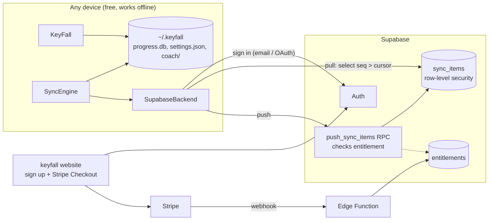
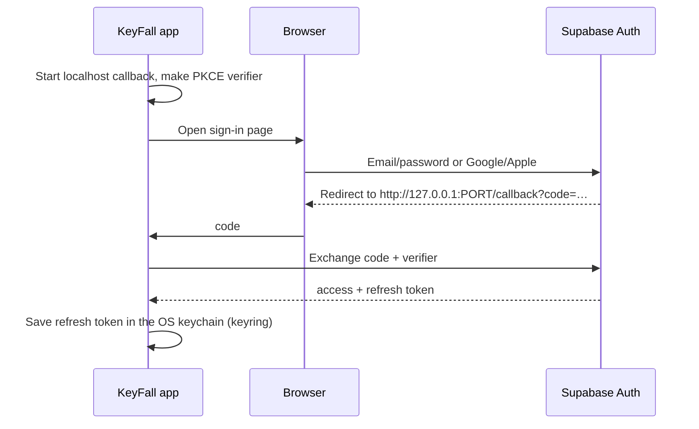
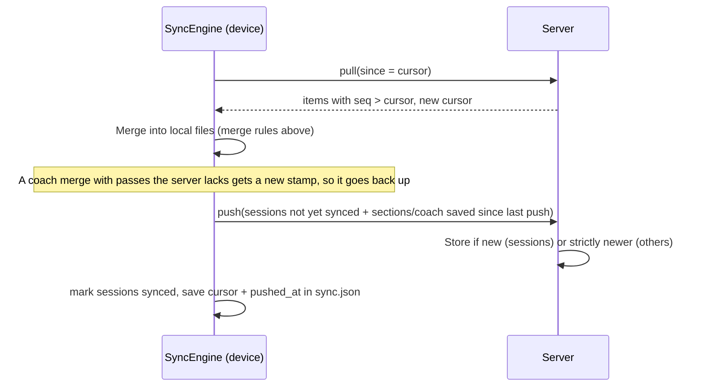

# 0018 — Accounts and sync (KeyFall Plus)

## Summary

KeyFall stays free to install and play, fully offline, on every device. An optional paid
account ("KeyFall Plus") syncs the player's progress between devices, the way Zotero
works: create an account on the website, sign in from any copy of the app, and your stuff
is there.

The first version runs on **Supabase** (hosted Postgres, auth, storage). A self-hosted
sync service may replace it later (tracked as a separate GitHub issue).

## Principles

- **Local first.** The files in `~/.keyfall` stay the source of truth on each device. Sync
  is an add-on that swaps changes; the game never waits on the network.
- **Accounts and payment live on the website.** The app has a "Sign in" button and
  nothing for sale. Mobile builds don't need in-app purchases (see *App stores*).
- **The game is never paywalled.** Plus sells cloud services: sync, backup, web dashboard.
  The open-source client (Apache-2.0) stays complete for offline play. The server enforces
  the paid check, never the client.
- **If a subscription lapses, nothing is lost.** Local data is untouched, and the cloud
  copy stays readable. Only uploading stops.

## Architecture

### Sign-in flow (desktop)

## What syncs

| Kind | Local source | Key | Merge rule |
|---|---|---|---|
| `session` | `progress.db` → `sessions` | session UUID | Never changes once played: union |
| `settings` | `settings.json` sections `appearance`, `accessibility`, `practice` | section name | Newest `updated_at` wins, per section |
| `coach` | `coach/<song>.json` | song file hash (or `title:<name>`) | Union of practice passes; section progress from the newest save |

Not synced (for now): `devices` settings (MIDI port names are per machine), song files,
stems, and recordings. These are the user's own, often large, files. They could come later
as "Library sync" on Supabase Storage.

### Sync round

The engine pulls before it pushes, so a device always merges others' changes into its own
before uploading. That way the server's "newest wins" rule never drops a practice pass.

## Groundwork done (this change)

- `keyfall.storage`: one data folder (`KEYFALL_HOME` overrides `~/.keyfall`), a random
  per-install `device_id`, UTC timestamps, and song file hashing.
- Songs remember their file hash (`Song.source_hash`, `SessionStats.song_hash`), so a
  renamed file is still the same song on every device.
- `progress.db` schema v2: every session gets a `uuid`, `device_id`, `song_hash`, and
  `synced_at`. Existing databases migrate in place, and old `played_at` values become
  ISO-8601 UTC.
- `settings.json` stamps each section's last save under `_updated`. Accessibility settings
  now save through the same code.
- Coach state records `song_hash`, `updated_at`, and an id per practice pass, and
  `merge_coach_docs` combines two devices' progress.
- `keyfall.sync`: `SyncItem`, the `SyncBackend` protocol, `SyncEngine`, and an
  `InMemoryBackend` that follows the same rules as the server. `tests/test_sync.py` covers
  two devices converging.
- `docs/supabase/schema.sql`: tables, row-level security, the `push_sync_items` function,
  and the entitlement check.

## Next steps

1. **Supabase project.** Apply `schema.sql`. Turn on email + Google/Apple sign-in.
2. **`SupabaseBackend`** (`keyfall/sync_supabase.py`): PostgREST pull/push over HTTPS,
   token refresh, and a 401 → "sign in again" path. Pull with a small overlap (for example
   `seq > cursor - 50`); merges are idempotent, so this covers sequence values that commit
   out of order.
3. **Account screen** in Settings: Sign in / Sign out, "Last synced 2 min ago", Sync now.
   Sync on launch, after each song, and on exit, on a background thread.
4. **Website:** sign up, manage subscription (Stripe Checkout + Customer Portal), and a
   Stripe webhook Edge Function that writes `entitlements`.
5. **Account deletion and export** (GDPR): delete the auth user (cascades), and download
   all `sync_items` as JSON.

## App stores

The app only signs in and shows no prices, upgrade prompts, or links to buy. This is the
App Store's *free stand-alone companion to a paid web service* case (guideline 3.1.3(f),
"cloud storage"), and Google Play has a similar allowance. Desktop builds have no such
limit and may link to the website. Re-check both stores' current rules before the first
mobile submission.

## Pricing note

Competitors charge about $100–150/year, and KeyFall's pitch is "free, no subscription"
(`docs/competition.md`). Plus should be cheap and clearly about cloud services, for example
about $3/month or $25/year. It should never lock features of the offline game.

## Candidate Plus features

| Feature | What the player gets | Builds on |
|---|---|---|
| **Sync** | Same progress, settings, and coach plans everywhere | This plan |
| **Cloud backup & restore** | Reinstall or get a new computer and lose nothing; restore a snapshot | `sync_items` + Storage |
| **Library sync** | Your own MIDI/MusicXML songs, stem folders, and Free Play recordings on every device | Supabase Storage, per-user private bucket, keyed by `source_hash` |
| **Web progress dashboard** | Practice streaks, minutes per day, accuracy trends per song, from any browser | `sync_items` sessions + coach history |
| **AI practice coach (cloud)** | Weekly plan and written feedback from your whole history ("your left hand drags in bars 9–12") | `ai/practice_planner.py` + an LLM call on the server, so no API key ships in the client |
| **Song packs** | Curated, graded packs with fingering and hand splits, installed from the in-app browser | `docs/mockups/song_packs`; free packs for everyone, extra packs with Plus (desktop only, or web-purchased) |
| **Teacher / studio** | A teacher assigns songs and sees each student's progress; students join with a code | `sync_items` shared through a `studio_members` table (separate, higher tier) |
| **Family plan** | Several player profiles under one subscription | `profile_id` added to sync keys |
