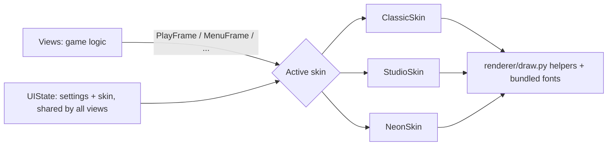

# Themes

KeyFall ships three visual themes. Pick one in **Settings** (press `S` on the main menu),
or for a single run with `keyfall --theme classic|studio|neon`.

| Theme | Feel |
|---|---|
| **Classic** | The original look: flat colors, monospace text. |
| **Studio** (default) | Modern and professional: calm palette, Inter type, timeline, accuracy and timing chart. |
| **Neon Arcade** | Rhythm-game energy: glowing notes, combo counter, score, judgement pop-ups, light beams and sparks. |

Settings also controls:

- **Visual effects**: Full / Reduced (no sparks) / Off (no glow, beams or sparks). Use a lower setting on slower computers.
- **Note labels**: off, letter names, solfège, or MIDI numbers on the falling notes.
- **Hand colors**: colorblind-friendly palettes. These always override the theme's own colors.

Choices are saved to `~/.keyfall/settings.json` (`appearance` and `accessibility` sections).

## How it works

- `renderer/theme.py`: color tokens, fonts and effect flags for each theme.
- `renderer/skins/`: one class per theme. Each draws whole screens from the plain data classes in `skins/frames.py`. Views never draw directly.
- `ui_state.py`: one `UIState` shared by every view, so a change in Settings restyles the whole app immediately.
- `renderer/skins/demo.py`: built-in demo passage used by the live preview in Settings.

To add a theme, add a `Theme` to `theme.py`, subclass `Skin` (implement `draw_play` and `draw_menu`;
Settings and Free Play are inherited), and register it in `renderer/skins/__init__.py`.

## Fonts

Inter, Orbitron and Rajdhani are bundled in `src/keyfall/assets/fonts/` under the SIL Open Font License
(see the `OFL-*.txt` files there). If a font file is missing, KeyFall falls back to a system font.

Screenshots of every theme are in `docs/screenshots/themes/`.
